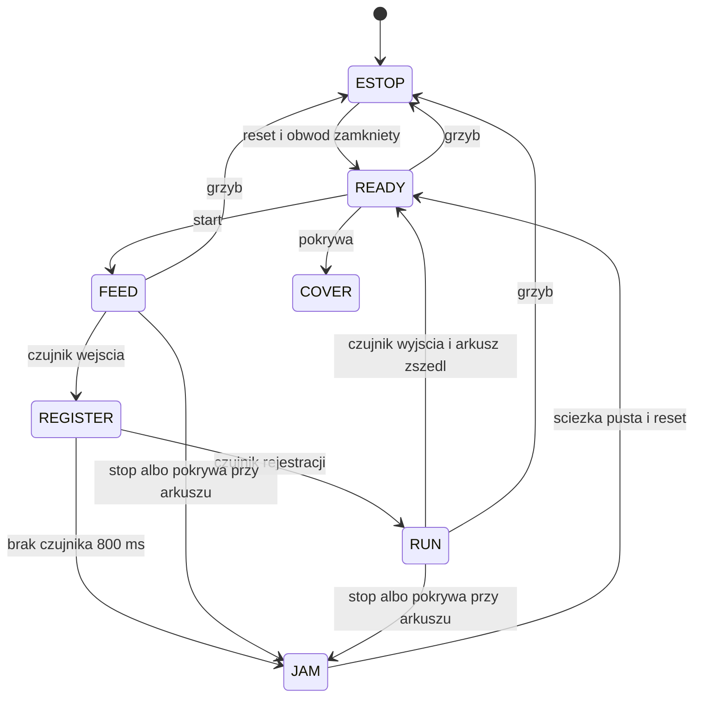

# Sekwencja

Cykl zadania 10 ms. Kasowanie po wlaczeniu zasilania jest obowiazkowe.

```mermaid
stateDiagram-v2
    [*] --> ESTOP
    ESTOP --> READY: reset i obwod zamkniety
    READY --> FEED: start
    FEED --> REGISTER: czujnik wejscia
    REGISTER --> RUN: czujnik rejestracji
    REGISTER --> JAM: brak czujnika 800 ms
    RUN --> READY: czujnik wyjscia i arkusz zszedl
    FEED --> JAM: stop albo pokrywa przy arkuszu
    RUN --> JAM: stop albo pokrywa przy arkuszu
    JAM --> READY: sciezka pusta i reset
    READY --> ESTOP: grzyb
    FEED --> ESTOP: grzyb
    RUN --> ESTOP: grzyb
    READY --> COVER: pokrywa
```
